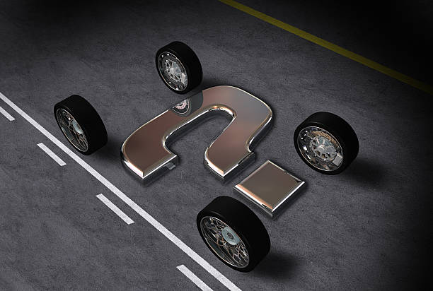
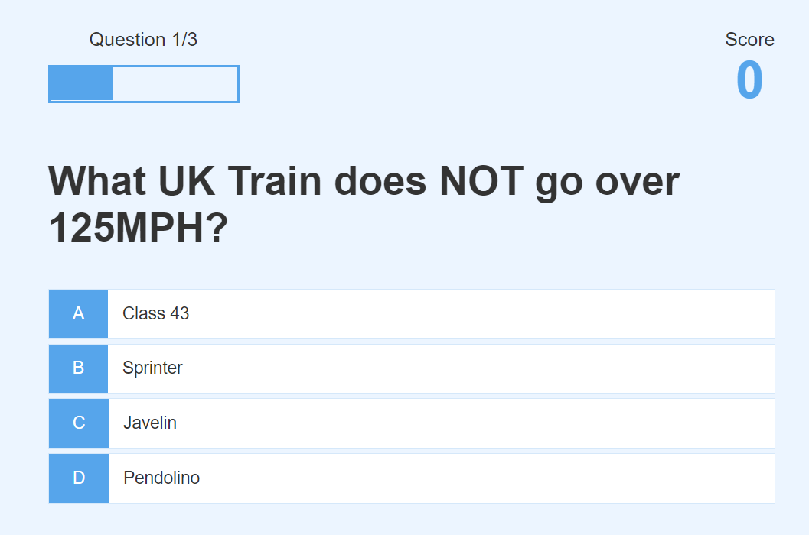

# Turbo Quiz

Want to improve your knowledge on vehicles? Aren't you curious about the vehicles you ride on? Here at Turbo Quiz we will put your knowledge to the test. Turbo Quiz, is a Questionaire about various different vehicles you see around you, from the ground to the skys. After you have answered the questions, you should have a better understanding of everything that goes on behind the shutters. If you're petrol head or someone who has no knowledge about vehicles this is the Turbo Quiz for you!

## Features

When you first arrive to the questionaire you will see the **Play** button and the **Highscores** button. The Play button will lead you directly to the Quiz, You will get 10 points per correct answer. The Highscores section will show you a list of all the players and their points, highest one will be at the top of the leader board.

## Existing Features

- __The Turbo Quiz Logo and Heading__
    - Featured at the top of the page, the Turbo Quiz logo and heading is easy to see for the user. Upon viewing the page, the user will be able to see the name of the game.

- __The Game Area__
    - This section will allow the user to play the Turbo Quiz. The user will be able to easily see the question and choices.
    - The user will be able to see how many points they have recieved and the progression of the quiz.

- __The Question section__
    - The question section is where the user will be able to see the randomized question rating from easy to difficult.
    - The user will be able to select the correct answer, if answered correctly, will display green, if incorrect will display red.

